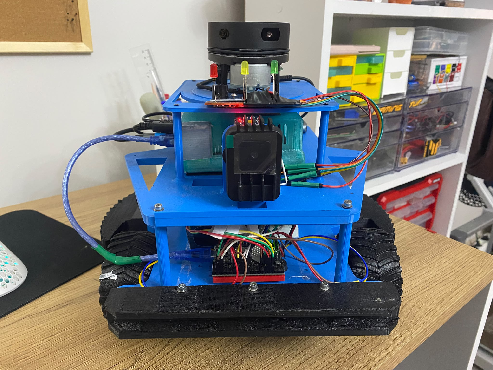

# Kâşif Çelebi — Arduino Mega ve ROS 2 Sensör Köprüsü



Bu proje, diferansiyel sürüşlü Kâşif Çelebi robotunun düşük seviye motor kontrolünü ve sensör okumalarını Arduino Mega 2560 üzerinde gerçekleştirir. Arduino verileri USB seri bağlantısı üzerinden JSON Lines biçiminde NVIDIA Jetson'a gönderir. Jetson'daki ROS 2 Humble köprüsü bu verileri standart ROS mesajlarına ve TF dönüşümlerine çevirir.

Proje hata toleranslı tasarlanmıştır: MPU6050 veya INA219 bulunamadığında motor kontrolü ve encoder/odometri veri akışı durmaz. Her sensörün geçerliliği ayrı bir durum alanıyla bildirilir.

## Sistem mimarisi

```text
                       I²C
MPU6050 ────────────────┐
                        ├── Arduino Mega 2560 ── USB/JSON ── NVIDIA Jetson
INA219 ─────────────────┘            │                            │
                                    ├── Motor sürücüsü            ├── /imu/data_raw
Sol/sağ encoder ─────────────────────┘                            ├── /wheel/encoders
                                                                 ├── /odom
                                                                 ├── odom -> base_link
                                                                 ├── /battery
                                                                 ├── /battery/power
                                                                 ├── /battery/remaining_minutes
                                                                 └── /battery/low
```

Arduino bir ROS 2 topic yayımlamaz. Arduino yalnızca USB seri portuna JSON satırları yazar. ROS topic'lerini Jetson üzerinde çalışan `serial_sensor_bridge.py` düğümü oluşturur.

## Dizin yapısı

```text
kasif_celebi/
├── platformio.ini
├── README.md
├── BATARYA_IZLEME_RAPORU.md
├── BATARYA_IZLEME_RAPORU.docx
├── src/
│   └── main.cpp
└── jetson_ros2_bridge/
    ├── serial_sensor_bridge.py
    ├── requirements.txt
    └── README.md
```

## Teknik raporlar

- [Batarya izleme raporu — Markdown](BATARYA_IZLEME_RAPORU.md)
- [Batarya izleme raporu — Word](BATARYA_IZLEME_RAPORU.docx)

Raporlarda INA219 güç bağlantısı, D22–D25 pinleri, pil yüzdesi ve kalan süre
hesabı, LED/buzzer davranışı, USB JSON alanları ve ROS 2 topic'leri ayrıntılı
olarak açıklanır.

## Kullanılan donanım

- Arduino Mega 2560 veya Mega 2560 Pro Mini
- Çift kanallı motor sürücüsü
- İki adet quadrature encoder
- MPU6050 IMU — isteğe bağlı
- INA219 akım/gerilim sensörü — isteğe bağlı
- 4S 3300 mAh 40C LiPo pil
- Aktif buzzer ve kırmızı/sarı/yeşil durum LED'leri
- NVIDIA Jetson üzerinde ROS 2 Humble

## Pin bağlantıları

### Motor sürücüsü ve encoderlar

| İşlev | Mega pini |
|---|---:|
| Sol encoder A | 2 |
| Sol encoder B | 3 |
| Sağ encoder A | 18 |
| Sağ encoder B | 19 |
| Motor A PWM | 5 |
| Motor A IN1 / IN2 | 7 / 8 |
| Motor B PWM | 6 |
| Motor B IN1 / IN2 | 9 / 10 |
| Motor sürücü STBY | 11 |
| LOW-tetiklemeli aktif buzzer modülü | 22 |
| Kırmızı LED | 23 |
| Sarı LED | 24 |
| Yeşil LED | 25 |

LED'lerde seri 220–330 ohm direnç kullanılmalıdır. LOW-tetiklemeli aktif buzzer
kritik durumda 3 saniyelik bildirim ritmini alarm başlar başlamaz ve sonrasında
her 20 saniyede bir çalar; aradaki 17 saniye sessizdir. Alarm yokken D22 HIGH
tutularak buzzer kapatılır. Yeşil LED sürekli yanmak yerine her 3 saniyede bir
300 ms süreyle yanar.

### I²C sensörleri

MPU6050 ve INA219 aynı I²C hattını farklı adreslerle paylaşabilir:

| Sensör pini | Mega 2560 |
|---|---|
| SDA | Pin 20 / SDA |
| SCL | Pin 21 / SCL |
| GND | GND |
| VCC | Sensör kartına uygun 3,3 V veya 5 V |

Yaygın adresler:

| Sensör | I²C adresi |
|---|---|
| MPU6050, AD0 LOW | `0x68` |
| MPU6050, AD0 HIGH | `0x69` |
| INA219 | `0x40` |

## Önemli INA219 güvenlik uyarısı

Standart `R100` şöntlü INA219 modülü yüksek akımlı ana motor hattı için uygun olmayabilir. Projedeki `setCalibration_32V_2A()` ayarı yaklaşık 2 A ölçüm aralığı kullanır.

4S 3300 mAh 40C pil teorik olarak çok yüksek akım sağlayabilir. Bu projede ölçülen
en yüksek toplam akım 1,5 A olduğu için 32 V / 2 A INA219 kalibrasyonu kullanılır.
Motorların çalışma veya stall akımı 2 A'yı geçerse standart INA219 kartını ana
motor hattına bağlamayın. INA226/INA228 ve akıma uygun harici düşük değerli şönt
kullanın.

Hiçbir sensör INA219 üzerinden beslenmemelidir. MPU6050 ve diğer sensörler Arduino veya uygun regülatörden beslenir. INA219 yalnızca ölçülecek güç hattına seri bağlanır:

```text
Pil (+) ── INA219 VIN+ / VIN- ── ölçülecek yük (+)
Pil (-) ──────────────────────── yük GND
   └──────────────────────────── Arduino ve INA219 GND
```

Yanmış veya hasarlı bir INA219 kartını yeniden bağlamayın.

## Arduino yazılımının çalışma sırası

1. Seri port `115200` baud ile başlatılır.
2. I²C hattı `100 kHz` olarak başlatılır ve `50 ms` timeout etkinleştirilir.
3. Motor ve encoder pinleri hazırlanır.
4. MPU6050 aranır. Bulunursa ayarlanır ve araç hareketsizken kalibre edilir.
5. INA219 aranır. Bulunursa batarya gerilimi ve başlangıç doluluk tahmini alınır.
6. Ana döngü 10 Hz çalışır:
   - Jetson'dan motor komutu okunur.
   - Bir saniye komut alınmazsa watchdog motorları durdurur.
   - Encoder sayıları alınır ve P kontrol uygulanır.
   - Mevcut sensörlerden ölçüm alınır.
   - Pil yüzdesi, kalan süre, LED'ler ve buzzer alarmı güncellenir.
   - Tek satırlık JSON paketi USB'ye yazılır.

## Pil yüzdesi ve kalan süre hesabı

Pil 4S 3300 mAh olarak tanımlıdır. Hücre başına 4,20 V yüzde 100, 3,00 V yüzde
0 sınırıdır; paket sınırları 16,80 V ve 12,00 V'tur. Başlangıç tahmininde doğrusal
gerilim hesabı yerine LiPo açık-devre gerilim tablosu kullanılır. Çalışma sırasında
INA219 akımı trapez integrasyonu ile toplanır (coulomb counting). Pil düşük akımda
30 saniye dinlenirse sayaç, gerilim tablosuna doğru yavaşça düzeltilir.

Ölçümler EMA ile süzülür. Kalan süre son 60 saniyenin filtrelenmiş ortalama
deşarj akımından hesaplanır. Tahmin 5 dakikanın altında 10 saniye kalırsa buzzer
uyarısı etkinleşir. Paket 12,00 V altında 2 saniye kalırsa süre tahmini beklenmeden
kritik alarm verilir.

Pil göstergesi yüzde 80–100 arasında yeşil, yüzde 50–79 arasında sarı ve yüzde
0–49 arasında kırmızıdır. Sınır çevresindeki titreşimi önlemek için yüzde 2
histerezis uygulanır. INA219 bulunamazsa kırmızı LED yanıp söner ve buzzer kapalı
kalır.

Kalan kapasite EEPROM'da 16 döner kayıt yuvasına, iki dakikadan daha sık
olmayacak şekilde ve yüzde en az 1 değiştiğinde kaydedilir. Bu sayede yeniden
başlatmada sayaç korunur ve EEPROM aşınması tek adreste toplanmaz.

Sensör başlangıçlarında `while (1)` kullanılmaz. Bir sensör bulunamadığında yalnız o sensörün `*_ok` alanı `false` olur.

## Motor komutları

Jetson Arduino'ya tek karakter gönderir:

| Komut | İşlev |
|---|---|
| `W` | İleri |
| `X` | Geri |
| `A` | Sola dön |
| `D` | Sağa dön |
| `S` | Dur |

Bir saniye boyunca komut alınmazsa güvenlik watchdog'u hedef hızları sıfırlar.

## USB JSON protokolü

Arduino her 100 ms'de bir JSON satırı gönderir:

```json
{
  "t_ms": 12345,
  "imu_ok": false,
  "ax": 0.0,
  "ay": 0.0,
  "az": 0.0,
  "gx": 0.0,
  "gy": 0.0,
  "gz": 0.0,
  "enc_l": 120,
  "enc_r": 118,
  "battery_ok": false,
  "voltage": 0.0,
  "current": 0.0,
  "power": 0.0,
  "charge": 0.0,
  "capacity": 3.3,
  "percentage": 0.0,
  "cell_voltage_avg": 0.0,
  "average_discharge_current": 0.0,
  "remaining_minutes": null,
  "battery_confidence": 0.0,
  "low_battery": false
}
```

Alanlar:

| Alan | Birim / anlam |
|---|---|
| `t_ms` | Arduino açılışından beri geçen ms |
| `imu_ok` | MPU6050 ölçümünün geçerli olup olmadığı |
| `ax`, `ay`, `az` | İvme, m/s² |
| `gx`, `gy`, `gz` | Açısal hız, rad/s |
| `enc_l`, `enc_r` | Sol ve sağ encoder ham tick sayısı |
| `battery_ok` | INA219 ölçümünün geçerli olup olmadığı |
| `voltage` | Pil gerilimi, V |
| `current` | Akım, A; ROS kuralına göre deşarjda negatif |
| `power` | Güç, W; deşarjda negatif |
| `charge` | Tahmini kalan kapasite, Ah |
| `capacity` | Pil kapasitesi, Ah |
| `percentage` | Doluluk, 0,0–1,0 |
| `cell_voltage_avg` | Paket geriliminin dört hücreye bölünmüş ortalaması, V |
| `average_discharge_current` | Kalan süre hesabında kullanılan ortalama akım, A |
| `remaining_minutes` | Tahmini kalan süre; hesaplanamıyorsa `null` |
| `battery_confidence` | SoC tahmin güveni, 0,0–1,0 |
| `low_battery` | Beş dakika/kritik gerilim alarm durumu |

## Sensörlerin bağımsız davranışı

| MPU6050 | INA219 | Sonuç |
|---|---|---|
| Var | Var | Tüm mesajlar yayımlanır |
| Yok | Var | Encoder/odometri ve batarya çalışır; IMU yayımlanmaz |
| Var | Yok | IMU ve encoder/odometri çalışır; batarya `present=false` olur |
| Yok | Yok | Motor ve encoder/odometri çalışmaya devam eder |

## PlatformIO ile derleme ve yükleme

Proje dizinine girin:

```bash
cd ~/Documents/PlatformIO/Projects/kasif_celebi
```

Derleyin:

```bash
~/.platformio/penv/bin/pio run
```

Arduino `/dev/ttyUSB0` üzerindeyse yükleyin:

```bash
~/.platformio/penv/bin/pio run --target upload --upload-port /dev/ttyUSB0
```

Ham seri çıktıyı kontrol edin:

```bash
~/.platformio/penv/bin/pio device monitor --port /dev/ttyUSB0 --baud 115200
```

Port adı sistemde farklı olabilir:

```bash
ls /dev/ttyUSB* /dev/ttyACM* 2>/dev/null
```

## Jetson ROS 2 köprüsü

Gerekli paketler:

```bash
sudo apt install ros-humble-tf2-ros ros-humble-sensor-msgs \
  ros-humble-nav-msgs python3-serial
```

ROS ortamını yükleyin:

```bash
source /opt/ros/humble/setup.bash
```

Bridge'i `/dev/ttyUSB0` ile çalıştırın:

```bash
cd ~/Documents/PlatformIO/Projects/kasif_celebi/jetson_ros2_bridge

python3 serial_sensor_bridge.py --ros-args \
  -p port:=/dev/ttyUSB0 \
  -p baudrate:=115200 \
  -p wheel_radius_m:=0.05 \
  -p wheel_separation_m:=0.30 \
  -p ticks_per_revolution:=600.0
```

Gerçek Jetson portu `/dev/ttyACM0` ise parametreyi buna göre değiştirin.

## ROS 2 topic'leri

| Topic / TF | Mesaj tipi | Davranış |
|---|---|---|
| `/imu/data_raw` | `sensor_msgs/msg/Imu` | Yalnız `imu_ok=true` olduğunda yayımlanır |
| `/wheel/encoders` | `std_msgs/msg/Int64MultiArray` | `[sol_tick, sağ_tick]` |
| `/odom` | `nav_msgs/msg/Odometry` | Diferansiyel sürüş odometrisi |
| `odom -> base_link` | TF | Odometri dönüşümü |
| `/battery` | `sensor_msgs/msg/BatteryState` | INA219 yoksa `present=false`, ölçümler `NaN` |
| `/battery/power` | `std_msgs/msg/Float32` | INA219 yoksa `NaN` |
| `/battery/remaining_minutes` | `std_msgs/msg/Float32` | Hesaplanamıyorsa `NaN` |
| `/battery/low` | `std_msgs/msg/Bool` | Arduino düşük pil alarmı |

Topic'leri kontrol edin:

```bash
ros2 topic list
ros2 topic hz /wheel/encoders
ros2 topic echo /odom
ros2 topic echo /battery
ros2 topic echo /battery/power
ros2 topic echo /battery/remaining_minutes
ros2 topic echo /battery/low
```

## Odometri ayarları

Bridge parametreleri gerçek robota göre ölçülmelidir:

- `wheel_radius_m`: tekerlek yarıçapı
- `wheel_separation_m`: sol ve sağ tekerlek merkezleri arasındaki mesafe
- `ticks_per_revolution`: bir tekerlek turundaki encoder tick sayısı
- `left_encoder_sign`, `right_encoder_sign`: yön tersse `-1.0`

Yanlış parametreler `/odom` mesafe ve açı hesabını bozar.

## Sorun giderme

### Topic var ama veri yok

Önce Arduino'nun ham JSON gönderdiğini doğrulayın:

```bash
stty -F /dev/ttyUSB0 115200 raw -echo
timeout 10 cat /dev/ttyUSB0
```

Aynı seri portu yalnızca bir program açmalıdır. Bridge çalışırken `cat` veya serial monitor açmayın.

### MPU6050 bulunamıyor

- SDA/SCL bağlantısını kontrol edin.
- I²C scanner ile `0x68` veya `0x69` adresini arayın.
- `imu_ok=false` olsa bile encoder ve odometri çalışmaya devam eder.

### INA219 bulunamıyor

- I²C scanner ile `0x40` adresini arayın.
- `/battery` mesajında `present=false` beklenir.
- Diğer sensörler ve odometri etkilenmez.

### JSON paketleri geçersiz görünüyor

Baud her iki tarafta da `115200` olmalıdır. Jetson bridge seri timeout değeri uzun JSON paketleri tamamlanabilsin diye `0.2` saniyedir.

## Mevcut sınırlamalar

- MPU6050 mutlak yönelim üretmez; `orientation_covariance[0] = -1` kullanılır.
- Pil yüzdesinin doğruluğu INA219 gerilim/akım kalibrasyonuna, pilin gerçek
  kullanılabilir kapasitesine, sıcaklığa ve pil yaşına bağlıdır.
- Kalan kapasite EEPROM'dan geri yüklenir; EEPROM kaydı geçersizse veya takılan
  pilin gerilimiyle büyük ölçüde uyuşmuyorsa başlangıç değeri OCV tablosundan
  yeniden hesaplanır.
- INA219 yalnız toplam paket gerilimini ölçer. Tek hücrelerin 3,00 V altına
  düşmesini güvenilir biçimde algılamak için 4S BMS veya hücre bazlı ölçüm gerekir.
- INA219, mevcut ayarda yaklaşık 2 A ile sınırlıdır. Robot akımı 2 A'ı aşarsa
  daha yüksek akıma uygun sensör ve şönt kullanılmalıdır.
- `sensor_msgs/msg/BatteryState` içinde güç alanı bulunmadığı için güç `/battery/power` topic'inde ayrıca yayımlanır.
- SLAM için ayrıca LiDAR `/scan` topic'i ve doğru statik TF dönüşümleri gerekir.
